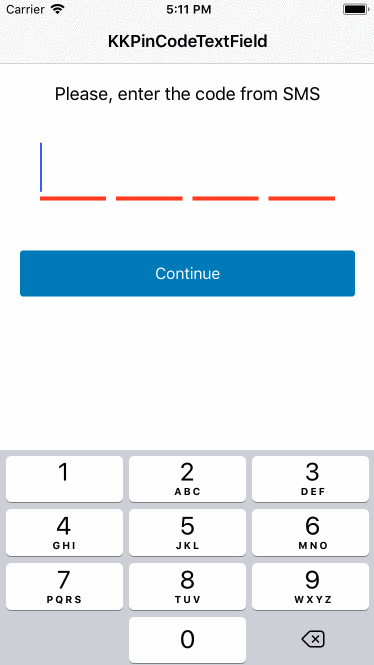
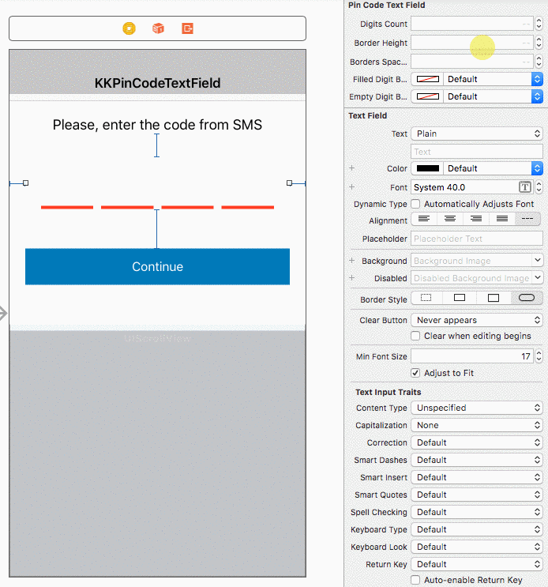

# KKPinCodeTextField





## Example

To run the example project, clone the repo, and run `pod install` from the Example directory first.


## Requirements

- iOS 8.0+


## Installation

KKPinCodeTextField is available through [CocoaPods](http://cocoapods.org). To install
it, simply add the following line to your Podfile:

```ruby
pod 'KKPinCodeTextField'
```


## Usage

1. Interface Builder:

Add a `UITextView` in your *Interface Builder* and change the class of a textView from `UITextView` to `KKPinCodeTextView`. You can set the properties in the *Attributes Inspector* and see a live preview



2. Programmatically:

```
KKPinCodeTextField *textField = [[KKPinCodeTextField alloc] initWithFrame:frame];
[self.view addSubview:textField];
```


## Customization

##### digitsCount
Verification code length. Default value is 4

##### borderHeight
Bottom borders height. Default value is 4

##### bordersSpacing
Spacing between bottom borders. Default value is 10

##### filledDigitBorderColor
Bottom border color when digit is filled. Default value is UIColor.lightGrayColor

##### emptyDigitBorderColor
Bottom border color when digit is empty. Default value is UIColor.redColor


## Author

Amirzhan, idryshev@kolesa.kz


## Contributing

Bug reports and pull requests are welcome


## License

KKPinCodeTextField is available under the MIT license. See the LICENSE file for more info.
